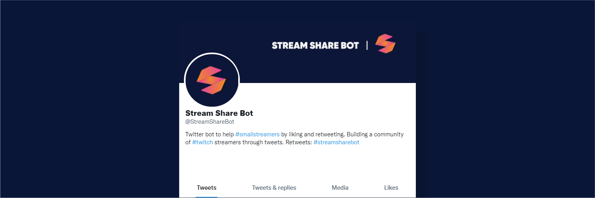

# Stream Share Bot

<a href="https://twitter.com/streamsharebot" target="_blank">
<a href="https://github.com/KieronJenkins" target="_blank">
<a href="https://uk.linkedin.com/in/kieronjenkins" target="_blank">
<a href="https://www.python.org/" target="_blank">

## About
Twitter bot to help #smallstreamers by liking and retweeting. Building a community of #twitch streamers through tweets. Retweets: #streamsharebot

## Two main objectives
1. Bot must search through hashtags on Twitter
2. Bot must favourite and retweet posts from small Twitch streamers using certain hashtags 

## Using the hashtags
For the bot to favourite and retweet a post the user must have one of the following hashtags: #smallstreamer, #supportsmallstreamers and #streamsharebot

## Why Twitch
Twitch is a well known live streaming platform owned by Amazon. Many companies now use the platform to promote, document and market various products to the general public with the main product being video games.

Sadly, I've often found Twitch to be a top-heavy platform with the majority of views and subscriptions going towards the bigger streamers on the platform. This is where Stream Share Bot comes in, the idea is that it solely promotes smaller streamers to a community of smaller streamers to boost visibily and allow for networking opportunities.

## References
- Streaming Statistics by dacast: [dacast.com](https://www.dacast.com/blog/66-must-know-live-streaming-statistics/)
